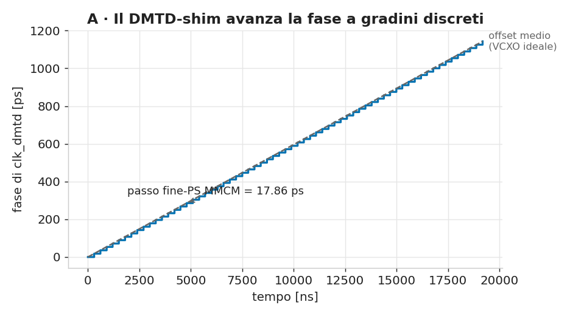
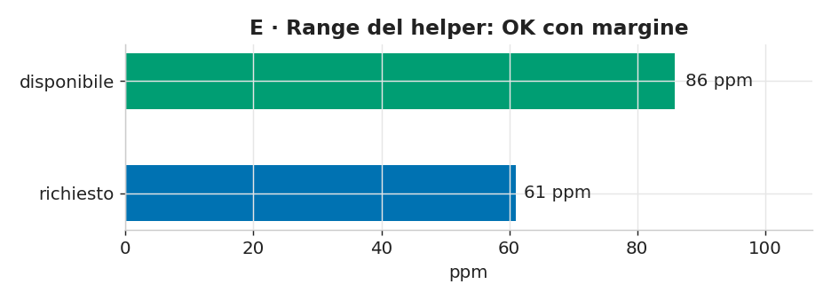
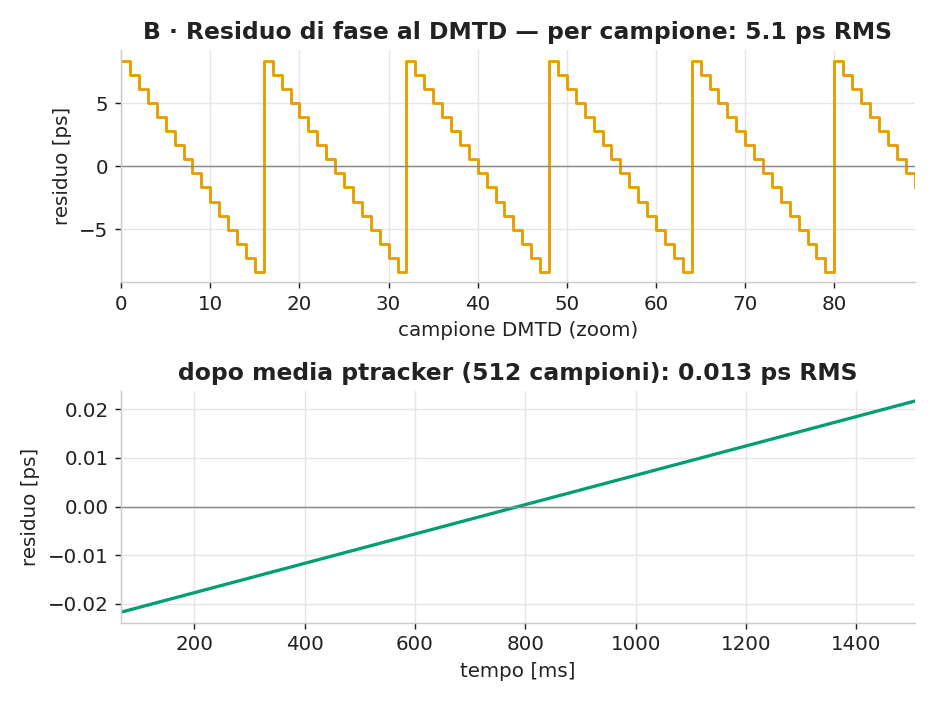
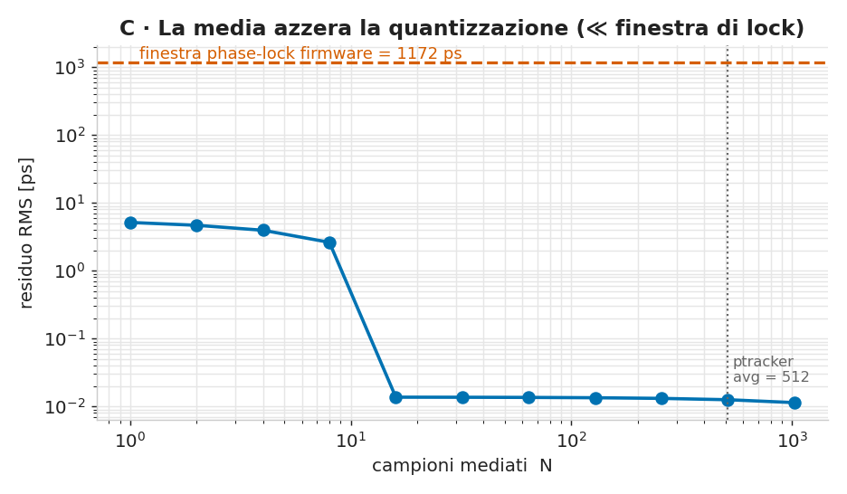
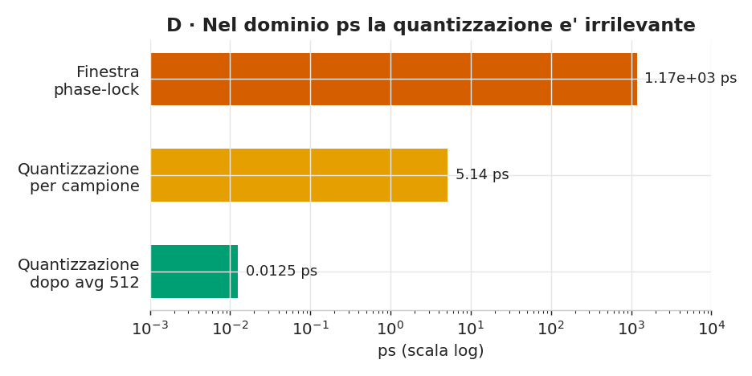
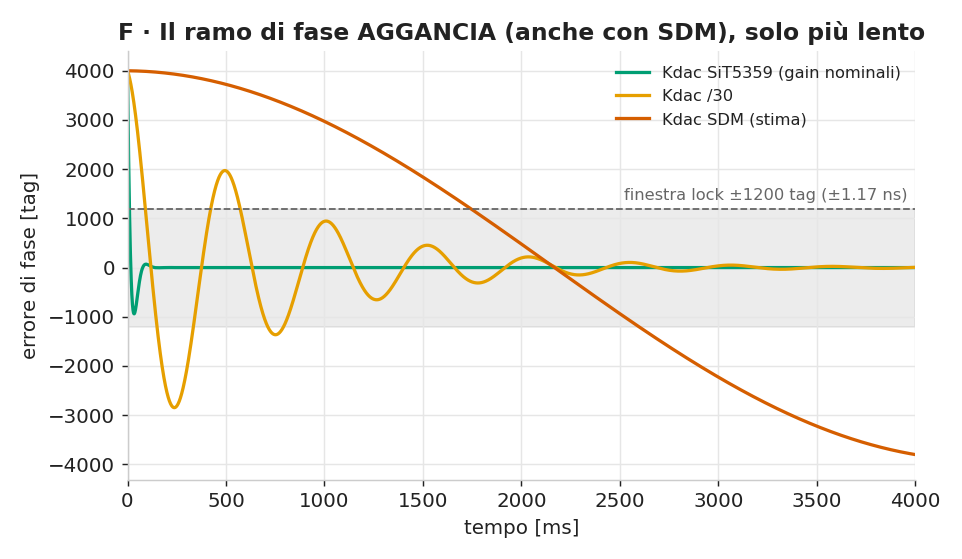
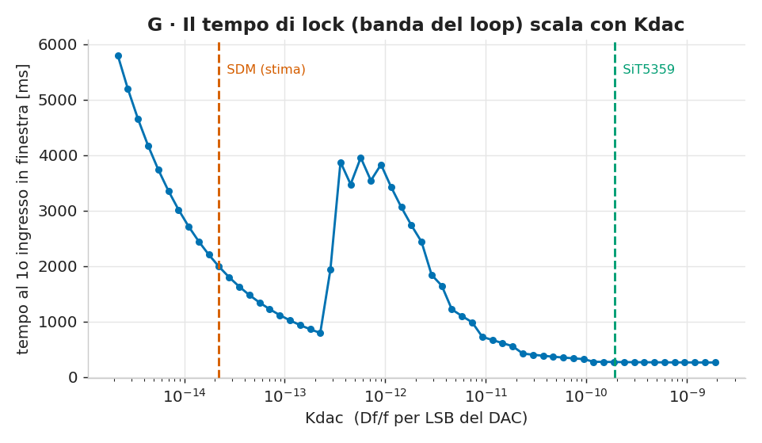
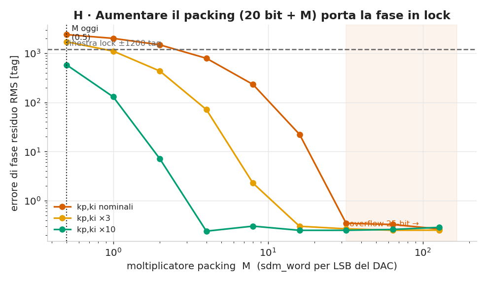

# Analisi dell'aggancio di FASE WR (perché MFL1 sì, MPL0 no)

Con il link WR col partner WR-ZEN su (7 lug), il softpll aggancia la **frequenza**
(`MFL1`) ma **non la fase** (`MPL0`), resta a `seq:wait-main` e il `ptracker` non
diventa `ready`. Questa cartella raccoglie l'analisi che ha ristretto le cause,
con un modello numerico del path DMTD e le figure.

Riproduci tutto con: `python3 make_figs.py` (numpy + matplotlib).

## Il sospettato iniziale: il DMTD "shim"
Il WR classico usa un **helper VCXO** (o un DCXO come il **SiT5359**, che infatti
il firmware babywr si aspetta: `board.h → BASE_SIT5359_DMTD`) per generare il clock
di offset del DMTD con un piccolo **offset di frequenza continuo**. Il design KR260
lo **sostituisce** con uno *shim*: un **MMCM** (`MMCME4_ADV`, Fvco 1 GHz) il cui
**fine-phase-shift** è pilotato da un **sigma-delta del 1° ordine** (`mmcm_psen_dac`,
`g_acc_bits=18`). Ogni impulso PSEN sposta la fase di **17.86 ps** (= T_vco/56).



*Fig. A — invece di una rampa liscia (offset medio, tratteggio grigio), la fase di
`clk_dmtd` avanza a **gradini discreti da 17.86 ps**.*

Ipotesi: questa quantizzazione sporca la misura di fase del DMTD → il ramo di fase
del main non aggancia e il ptracker non converge. Il modello la mette alla prova.

## Cosa dice il modello

### 1) Range del helper — OK
Il beat DMTD richiede un offset di **1/2¹⁴ ≈ 61 ppm**. Il sigma-delta a `g_acc=18`
(limitato dall'handshake PSDONE) arriva a **~86 ppm** → **margine sufficiente**.
(All'inizio avevo assunto `g_acc=20` → ~35 ppm "insufficiente": era un mio errore,
l'istanza reale è `g_acc=18`.)



### 2) Quantizzazione — si media via, non è il collo di bottiglia
Il DMTD campiona una volta per beat (ogni 2¹⁴ cicli, **3.815 kHz**). La
quantizzazione del sigma-delta si presenta come un **dente di sega da ±8.9 ps**
(**~5.1 ps RMS**) per campione. Ma il **ptracker media 512 campioni**: essendo il
dente di sega periodico (periodo 16 campioni), la media lo **annulla** a
**~0.013 ps RMS**.



Al crescere della finestra di media il residuo crolla a N=16 (periodo del dente) e
resta piatto, **ordini di grandezza sotto la finestra di phase-lock del firmware**
(soglia `1200/2¹⁴ × 16 ns = **1172 ps**).



Nel dominio dei ps il confronto è netto:



## Verdetto

| Ipotesi | Esito |
|---|---|
| Range del helper insufficiente | ❌ eliminata (86 > 61 ppm) |
| Rumore di quantizzazione del DMTD-shim | ❌ eliminata (media 512 → 0.013 ps ≪ 1172 ps) |
| Plumbing (canale/ptracker) | ✔ verificato OK (`n_ref 1`, ptracker `en 1 id 0`; e i tag del recovered clock **si aggiornano**, altrimenti `MFL1` non ci sarebbe) |

→ Il collo di bottiglia **non** è il DMTD-shim sul piano analogico, né
l'instradamento. È il **ramo di FASE del `main`**: deve stabilizzarsi entro
**±1.17 ns per 1000 campioni** (`spll_main.c`, `phase_ld`) e non ci riesce.

**Indizio decisivo dai dati di banco:** nel `pll stat` la fase del ptracker è
**fissa** (`5366`), non rumorosa. Un valore *fisso* non è quantizzazione (che
darebbe un valore *variabile*): è coerente con un ramo di fase **che non converge /
non avanza** — cioè un problema di **dinamica/guadagno del loop**, non di misura.

### Sospetto residuo e prossimi passi
I guadagni PI del `main` (`m_kp=-1800, m_ki=-25`) sono quelli pensati per il
**DCXO SiT5359** che il firmware si aspetta; l'attuatore reale è l'**SDM**, con un
guadagno (Hz/LSB) diverso. Il ramo di frequenza (largo, tollerante) regge; quello
di **fase** (stretto) no → tipico di un **loop mistarato**.

Da fare (prossima sessione, scheda accesa):
1. **Loopback + cattura `pll stat`**: verificare se la fase del ptracker **si
   muove** (misura viva) o resta fissa (conferma dinamica/loop).
2. **ILA su `sdm_word`** mentre slave: vedere se il `main` sta *muovendo* l'SDM per
   la fase o è fermo/oscilla.
3. **Ritaratura dei guadagni** del ramo di fase del `main` per il guadagno reale
   dell'attuatore SDM (misurato dal v6), eventualmente riducendo la banda.

I parametri e le formule sono in [`../wrc/README.md`](../wrc/README.md) e nel
sorgente `make_figs.py`.

---

## Modello closed-loop del ramo di fase (`closed_loop_model.py`)

Escluso il DMTD-shim, il sospetto si sposta sul **ramo di fase del `main`**. Qui
un modello **closed-loop** che replica il **PI a virgola fissa del firmware**
(`spll_common.c`: `y = ((integ + ki·x) + (kp·x) + rounding) >> shift + bias`,
clamp + anti-windup) chiuso sul plant fase (attuatore → Δf → integratore di fase
→ tag DMTD). Parametri reali: DAC 20 bit, `bias=2¹⁹`, `kp=-1800, ki=-25, shift=12`
(`board.c` stages[0]), soglia lock ±1200 tag (±1.17 ns) per 1000 campioni.

L'unico parametro incerto è il **guadagno dell'attuatore** `Kdac = (Δf/f)/LSB`.
Il firmware babywr è tarato per un **DCXO SiT5359** (~0.19 ppb/LSB); l'attuatore
reale è l'**SDM**, stimato **molto più debole** (~0.00002 ppb/LSB dal v6, **da
misurare**).



*Fig. F — il modello **valida**: coi gain nominali + guadagno SiT5359 (verde) la
fase aggancia pulito in ~272 ms. Al calare di `Kdac` il loop rallenta e si
**sotto-smorza** (arancio `/30` oscilla); alla stima **SDM (rosso)** è
un'oscillazione lenta e ampia che **sfiora** la finestra ma **non ci resta**.*



*Fig. G — la velocità del loop (banda) scala con `Kdac`: SiT5359 veloce, SDM
lentissimo.*

### Verdetto (onesto)
- Il modello **valida** (SiT5359 → lock pulito).
- Alla **stima** `Kdac_SDM` il ramo di fase **non tiene il lock stabile** →
  **consistente con l'MPL0 di banco**. Il collo di bottiglia è la **banda del
  loop**, cioè il **guadagno dell'attuatore SDM**, troppo basso rispetto al
  SiT5359 per cui i gain sono tarati. Il **wander** reale del master (non
  modellato) peggiora ancora.
- **Caveat**: `Kdac_SDM` è una stima (v6); `S_PHI`/`f_upd` sono assunti.

### Cosa NON fare e cosa fare
- **Non** tarare `kp/ki` alla cieca. Prima **misurare `Kdac`** a banco (step del
  DAC main via softpll, Δf col frequenzimetro).
- **Alzare la banda**: aumentare il **packing DAC→sdm_word** (oggi ×8) e/o
  `kp,ki`, e usare il **DAC a 20 bit senza troncarlo a 16**.
- Ri-verificare che la fase agganci e **resti** (non derivi col wander).

---

## L'SDM è pilotato da RTL diretto — la leva è il packing (`packing_sweep.py`)

Domanda: i segnali SDM passano dal **DRP** (lento) o da RTL? Verificato in HDL:
```
softpll DAC → p_dac_to_sdm → sdm_word_sent → SDM0DATA[24:0]  (PIN del GTHE4)
                             toggle          → SDM0TOGGLE      (PIN)
```
Il **dato dell'attuatore è pin diretto**, **non** DRP (il DRP `0xA0020000` tocca
solo gli attributi di config della QPLL0). Quindi l'anello è **già sulla via
veloce**; l'unica latenza è l'handshake **SDM0TOGGLE a 64 cicli (~1 µs)**, ben
sotto il periodo di update del softpll (~262 µs) → **non è il collo di bottiglia**.

Il collo di bottiglia (il basso `Kdac` del modello) sta nel **packing**, con due
perdite di guadagno **entrambe correggibili in RTL puro** (niente DRP, niente
firmware):
1. il **DAC è troncato 20→16** (il softpll ne calcola 20, `BOARD_SPLL_DAC_BITS=20`)
   → 4 bit fini persi;
2. il moltiplicatore **×8** è piccolo (oggi ~**0.5 sdm_word per LSB del softpll**),
   mentre `sdm_word` è a **25 bit** con largo headroom.

### Quanto packing serve (sweep del moltiplicatore M)
`sdm_word += (dac20 − 2¹⁹) · M` → `Kdac = M · Kf` (`Kf` = Δf/f per LSB di
`sdm_word`, ~4.4e-14 dal v6). Vincolo 25-bit: **M ≤ 32**.



*Fig. H — errore di fase residuo vs M. Oggi M≈0.5 (residuo sopra la finestra →
no-lock). Con **M≈16–32 e i gain PI nominali** il residuo crolla ben sotto
±1200 tag → **lock**. Un bump `kp,ki ×3` sposta la soglia a M≈2.*

| gain PI | M=0.5 (oggi) | M=8 | M=16 | M=32 |
|---|---|---|---|---|
| nominali | 2411 (no-lock) | 233 ✔ | 22 ✔ | 0 ✔ |
| ×3 | 1719 | 2 ✔ | 0 ✔ | 0 ✔ |
| ×10 | 583 ✔ | 0 ✔ | 0 ✔ | 0 ✔ |

### Candidato e prossimo passo
- **Candidato**: packing a **20 bit pieni** + **M = 16–32**, gain PI **nominali**
  (RTL puro, `sdm_word` resta nei 25 bit). Snippet in
  [`packing_proposal.vhd`](packing_proposal.vhd).
- **Prima di fissare M**: **misurare `Kf`** a banco (step del DAC main via softpll,
  Δf col frequenzimetro) e rimetterlo nel modello — così M esce esatto invece che
  dalla stima v6.
